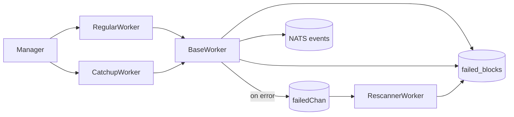

# Multi-Chain Transaction Indexer

Production-ready indexer for multiple blockchains with three cooperating workers: **Regular (real-time)**, **Catchup (historical)**, **Rescanner (failed/missed blocks)**.

## 🚀 Quick Start

```bash
git clone https://github.com/fystack/transaction-indexer.git
cd transaction-indexer
go mod download
go build -o indexer cmd/indexer/main.go

# Index EVM & TRON in real-time
./indexer index --chain=evm,tron

# Add catchup for historical gaps
./indexer index --chain=evm,tron --catchup
```

---

## ⚙️ Worker Logic

### **BaseWorker**

* Shared logic for all worker types
* Rate limiting, logging, bloom filter, KV store integration
* Sends error blocks to `failedChan` and stores in `failed_blocks/<chain>/<block>`

### **RegularWorker**

* Continuously processes latest blocks from RPC
* Saves progress to `latest_block_<chain>`
* On block failure → BaseWorker stores it for retry

### **CatchupWorker**

* Processes historical blocks in ranges `[start,end]`
* Uses KV `catchup/progress/<chain>/<start>-<end>` to track progress
* Deletes the key when a range is completed
* Integrates failed blocks from Rescanner

### **RescannerWorker**

* Re-processes failed blocks from KV `failed_blocks/<chain>/<block>` or `failedChan`
* Updates KV when retry succeeds
* Avoids current head block to reduce reorg risk

---

## 🗝️ KVStore Keys

| Key                                      | Purpose                          |
| ---------------------------------------- | -------------------------------- |
| `latest_block_<chain>`                   | RegularWorker progress           |
| `catchup/progress/<chain>/<start>-<end>` | CatchupWorker progress per range |
| `failed_blocks/<chain>/<block>`          | Failed blocks metadata for retry |
| `<chain>/<address>`                      | Public key store                 |

---

## 📊 Workflow Overview



**Logic Flow:**

1. RegularWorker: processes latest blocks, emits transactions, saves progress, reports errors.
2. CatchupWorker: fills historical gaps, tracks range progress, deletes range when done.
3. RescannerWorker: retries failed blocks, updates KV when successful.
4. BaseWorker: wraps all workers for unified error handling & KV interaction.

---

## 🔧 Configuration

* **Chains**: `evm`, `tron` (configurable start\_block, batch\_size, poll\_interval)
* **KVStore**: BadgerDB / in-memory
* **Bloom Filter**: Redis or in-memory for wallet addresses
* **Event Emitter**: NATS streaming
* **RPC Providers**: failover + rate-limiting per chain

---

## 🏗️ Core Principles

* **Multi-chain support**: Independent workers per chain
* **Auto-catchup**: Detect gaps → create ranges → process → cleanup
* **Failed block recovery**: Persisted, retryable, deduplicated
* **Real-time + historical + retry**: RegularWorker + CatchupWorker + RescannerWorker
* **State persistence**: KV + BlockStore → restart-safe

---

## ⚡ Usage Highlights

```bash
# Real-time only
./indexer index --chain=evm

# Real-time + catchup
./indexer index --chain=evm,tron --catchup

# Debug
./indexer index --chain=evm --debug

# NATS monitoring
./indexer nats-printer

# bloom filter and kvstore need to be initialized before running the indexer
./wallet-kv-load run --config configs/config.yaml --batch 10000 --debug

# migrate from badger to consul (edit migrate.yaml)
./kv-migrate run --config configs/config.yaml --dry-run
```
