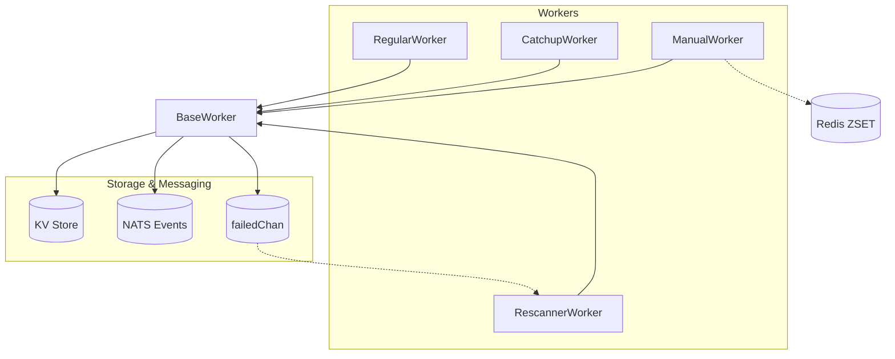

# Multi-Chain Transaction Indexer

Production-ready indexer for multiple blockchains with four cooperating workers:
**Regular (real-time)**, **Catchup (historical)**, **Rescanner (failed/missed blocks)**, **Manual (manual blocks)**.

This indexer is designed to be used in a multi-chain environment, where each chain is indexed independently and emits events.

---

## 🚀 Quick Start

```bash
git clone https://github.com/fystack/transaction-indexer.git
cd transaction-indexer
go mod download
cp configs/config.example.yaml configs/config.yaml
go build -o indexer cmd/indexer/main.go

# Index EVM & TRON in real-time
./indexer index --chains=ethereum_mainnet,tron_mainnet

# Add catchup worker for historical gaps
./indexer index --chains=ethereum_mainnet,tron_mainnet --catchup

# Add manual worker for missing blocks
./indexer index --chains=ethereum_mainnet,tron_mainnet --manual

# For help
./indexer --help
```

---

## ⚙️ Worker Logic

### **BaseWorker**

* Shared logic for all worker types
* Rate limiting, logging, bloom filter, KV store integration, infrastructure management
* Sends error blocks to `failedChan` and stores in `<chain>/failed_blocks/<block>`

---

### **RegularWorker**

* Continuously processes latest blocks from RPC
* Saves progress to `<chain>/latest_block`
* For EVM, handle reorgs with rollback window
* On block failure → BaseWorker stores it for retry

---

### **CatchupWorker**

* Processes historical blocks in ranges `[start,end]`
* Uses KV `<chain>/catchup_progress/<start>-<end>` to track progress
* Deletes the key when a range is completed
* Integrates failed blocks from Rescanner

---

### **ManualWorker**

* Handles **explicit missing blocks** (due to RPC errors, reorg skips, or manual intervention).
* Missing ranges are stored in **Redis ZSET**:

  * Member format: `"start-end"`
  * Score = `start` (to sort ranges by block number)
  * Large ranges split into small ranges (default 5 blocks) for finer retries
* **Concurrency-safe with Redis locks** (`SETNX + EX` via Lua)
* Workflow:

  1. Claim unprocessed range (`GetNextRange`)
  2. Process all blocks in `[start,end]`
  3. Update progress with `SetRangeProcessed`
  4. On full success → `RemoveRange`
  5. On partial timeout → reinsert remaining `[current,end]`

---

### **RescannerWorker**

* Re-processes failed blocks from KV `<chain>/failed_blocks/<block>` or `failedChan`
* Updates KV when retry succeeds
* Removes blocks after max retry attempts
* Skips chain head block to reduce reorg risk

---

## 🗝️ KVStore / Redis Keys

| Key                                      | Purpose                             |
| ---------------------------------------- | ----------------------------------- |
| `<chain>/latest_block`                   | RegularWorker progress              |
| `<chain>/catchup_progress/<start>-<end>` | CatchupWorker progress per range    |
| `<chain>/failed_blocks/<block>`          | Failed blocks metadata for retry    |
| `<chain_type>/<address>`                 | Public key store                    |
| `missing_blocks:<chain>`                 | Redis ZSET of missing ranges        |
| `processing:<chain>:<start>-<end>`       | Redis lock key for concurrent claim |
| `processed:<chain>:<start>-<end>`        | Last processed block in range       |

---

## 📊 Workflow Overview



**Logic Flow:**

1. **RegularWorker**: real-time indexing, reorg handling, error reporting
2. **CatchupWorker**: backfills gaps, tracks progress, cleans up ranges
3. **ManualWorker**: consumes Redis ranges, concurrent-safe backfill
4. **RescannerWorker**: retries failed blocks, updates KV on success

---

## ✅ Prerequisites

Start required services before running the indexer (docker-compose provided):

* NATS server (events)
* Consul (KV) or Badger (embedded)
* PostgreSQL (wallet address repo)
* Redis (for Bloom filter or ManualWorker)

```bash
docker-compose up -d
```

---

## 🔧 Configuration

* **Chains**: configurable (`start_block`, `batch_size`, `poll_interval`)
* **KVStore**: BadgerDB / in-memory / Consul
* **Bloom Filter**: Redis or in-memory
* **Event Emitter**: NATS streaming
* **RPC Providers**: failover + rate-limiting

See `configs/config.example.yaml` for details.

---

## 🏗️ Core Principles

* **Multi-chain support**: independent workers per chain
* **Auto-catchup**: detect gaps → backfill → cleanup
* **Failed block recovery**: persisted + retryable
* **Manual backfill**: Redis-driven, safe for concurrency
* **State persistence**: KV + BlockStore → restart-safe

---

Got it 👍 — let’s clean this up and make it **English-only**, with a clear **Usage Highlights** section and an **Example `configs/config.yaml`** snippet so new devs immediately know where chain names come from.

---

## ⚡ Usage Highlights

The chain names passed to `--chains` **must match the names defined in `configs/config.yaml`**.
Example: `ethereum_mainnet`, `tron_mainnet`.

```bash
# Real-time only
./indexer index --chains=ethereum_mainnet,tron_mainnet

# Real-time + catchup (fill historical gaps)
./indexer index --chains=ethereum_mainnet,tron_mainnet --catchup

# Add manual worker to process missing blocks from Redis
./indexer index --chains=ethereum_mainnet,tron_mainnet --manual

# Debug mode (extra logs)
./indexer index --chains=ethereum_mainnet,tron_mainnet --debug

# NATS event monitoring
./indexer nats-printer

# Initialize bloom filter and kvstore
./wallet-kv-load run --config configs/config.yaml --batch 10000 --debug

# Migrate from Badger to Consul (edit migrate.yaml first)
./kv-migrate run --config configs/config.yaml --dry-run
```

---

## 📝 Example `configs/config.yaml` (chains section)

```yaml
chains:
  ethereum_mainnet: # <- this is the chain name
    type: "evm"
    nodes:
      - url: "https://eth-mainnet.g.alchemy.com/v2/${API_KEY}"
        auth:
          type: "header"
          key: "Authorization"
          value: "Bearer ${API_KEY}"
      - url: "https://rpc.ankr.com/eth"
    start_block: 21500000
    poll_interval: "6s"
    client:
      timeout: "20s"
      max_retries: 3
      retry_delay: "5s"
      throttle:
        rps: 8
        burst: 16

  tron_mainnet:
    type: "tron"
    nodes:
      - url: "https://api.trongrid.io"
        auth:
          type: "header"
          key: "TRON-PRO-API-KEY"
          value: "${TRON_API_KEY}"
      - url: "https://tron-rpc.publicnode.com"
    start_block: 75144237
    poll_interval: "8s"
    client:
      timeout: "20s"
      max_retries: 5
      retry_delay: "10s"
      throttle:
        rps: 5
        burst: 8
```