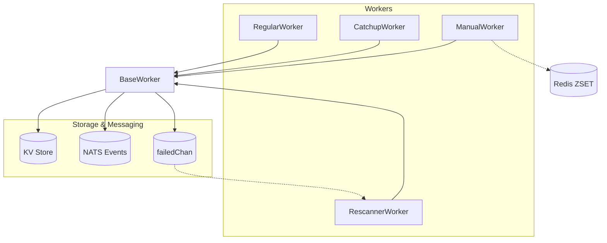

# Multi-Chain Transaction Indexer

Production-ready indexer for multiple blockchains with four cooperating workers:
**Regular (real-time)**, **Catchup (historical)**, **Rescanner (failed/missed blocks)**, **Manual (manual blocks)**.

## 🚀 Quick Start

```bash
git clone https://github.com/fystack/transaction-indexer.git
cd transaction-indexer
go mod download
cp configs/config.example.yaml configs/config.yaml
go build -o indexer cmd/indexer/main.go

# Index EVM & TRON in real-time
./indexer index --chains=evm,tron

# Add catchup worker for historical gaps
./indexer index --chains=evm,tron --catchup

# Add manual worker for missing blocks
./indexer index --chains=evm,tron --manual

# For help
./indexer --help
```

---

## ⚙️ Worker Logic

### **BaseWorker**

* Shared logic for all worker types
* Rate limiting, logging, bloom filter, KV store integration, infrastructure management
* Sends error blocks to `failedChan` and stores in `<chain>/failed_blocks/<block>`

---

### **RegularWorker**

* Continuously processes latest blocks from RPC
* Saves progress to `<chain>/latest_block`
* For EVM, handle reorgs with rollback window
* On block failure → BaseWorker stores it for retry

---

### **CatchupWorker**

* Processes historical blocks in ranges `[start,end]`
* Uses KV `<chain>/catchup_progress/<start>-<end>` to track progress
* Deletes the key when a range is completed
* Integrates failed blocks from Rescanner

---

### **ManualWorker**

* Special worker to handle **explicit missing blocks** (e.g. due to RPC errors, reorg skips, or manual intervention).
* Missing ranges are stored in **Redis ZSET**:

  * Member format: `"start-end"`
  * Score = `start` (to sort ranges by starting block)
  * Each large range is split into small ranges (default 5 blocks) for finer-grained retries.
* **Concurrent-safe with Redis locks**:

  * Before a worker processes a range, it atomically acquires a **lock key** (via Lua script `SETNX + EX`).
  * This ensures multiple ManualWorkers can run in parallel across processes without duplicate work.
* Workflow:

  1. Worker calls `GetNextRange()` → atomically claim one unprocessed range.
  2. Process all blocks in `[start,end]`.
  3. Update progress with `SetRangeProcessed()`.
  4. On full success → `RemoveRange()` (delete ZSET member + lock).
  5. On partial timeout → reinsert remaining `[current,end]` as a new range.

---

### **RescannerWorker**

* Re-processes failed blocks from KV `<chain>/failed_blocks/<block>` or `failedChan`
* Updates KV when retry succeeds
* Removes blocks after max retry attempts
* Avoids processing the current chain head block to reduce reorg risk

---

## 🗝️ KVStore / Redis Keys

| Key                                      | Purpose                             |
| ---------------------------------------- | ----------------------------------- |
| `<chain>/latest_block`                   | RegularWorker progress              |
| `<chain>/catchup_progress/<start>-<end>` | CatchupWorker progress per range    |
| `<chain>/failed_blocks/<block>`          | Failed blocks metadata for retry    |
| `<chain_type>/<address>`                 | Public key store                    |
| `<chain>/block_hash/<block>`             | Block hash for reorg detection      |
| `missing_blocks:<chain>`                 | Redis ZSET of missing ranges        |
| `processing:<chain>:<start>-<end>`       | Redis lock key for concurrent claim |
| `processed:<chain>:<start>-<end>`        | Last processed block in range       |

---

## 📊 Workflow Overview



**Logic Flow:**

1. **RegularWorker**: processes latest blocks, detects reorgs, emits transactions, saves progress, reports errors.
2. **CatchupWorker**: fills historical gaps, tracks range progress, deletes range when done.
3. **ManualWorker**: pulls missing ranges from Redis, claims lock for concurrency, processes blocks, reinserts unfinished ranges.
4. **RescannerWorker**: retries failed blocks, updates KV when successful.

---

## ✅ Prerequisites

* Start required services before running the indexer (docker-compose provided):

  * NATS server (events)
  * Consul (KV) or Badger (embedded) per your config
  * PostgreSQL (wallet address repo)
  * Redis (required if using Redis Bloom filter backend or ManualWorker)

```bash
docker-compose up -d
```

For configuration and usage details, see `configs/config.example.yaml` and adapt `configs/config.yaml`.

---

## 🔧 Configuration

* **Chains**: `evm`, `tron` (configurable `start_block`, `batch_size`, `poll_interval`)
* **KVStore**: BadgerDB / in-memory / Consul
* **Bloom Filter**: Redis or in-memory for wallet addresses
* **Event Emitter**: NATS streaming
* **RPC Providers**: failover + rate-limiting per chain

See `configs/config.example.yaml` for a full reference of fields and example values.

---

## 🏗️ Core Principles

* **Multi-chain support**: Independent workers per chain
* **Auto-catchup**: Detect gaps → create ranges → process → cleanup
* **Failed block recovery**: Persisted, retryable, deduplicated
* **Manual backfill**: Claimable Redis ranges, safe for concurrency
* **State persistence**: KV + BlockStore → restart-safe

---

## ⚡ Usage Highlights

```bash
# Real-time only
./indexer index --chains=evm

# Real-time + catchup
./indexer index --chains=evm,tron --catchup

# Add manual worker to process missing blocks
./indexer index --chains=evm,tron --manual

# Debug
./indexer index --chains=evm --debug

# NATS monitoring
./indexer nats-printer

# bloom filter and kvstore need to be initialized before running the indexer
./wallet-kv-load run --config configs/config.yaml --batch 10000 --debug

# migrate from badger to consul (edit migrate.yaml)
./kv-migrate run --config configs/config.yaml --dry-run
```